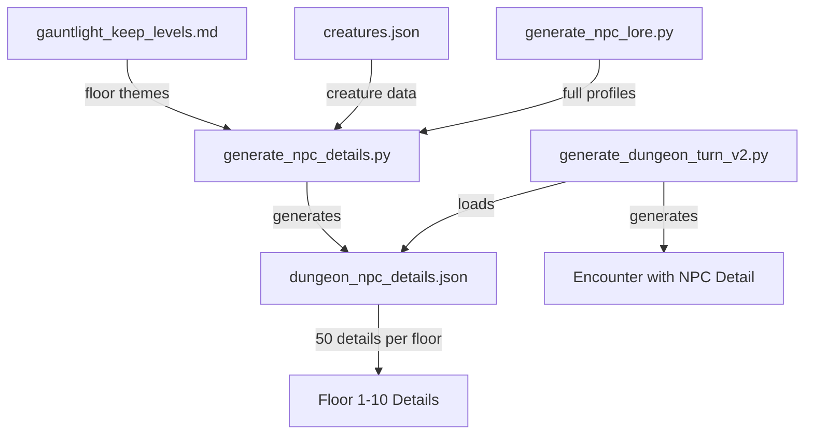

# Design Document: NPC Detail Generation for Gauntlight Keep

## Overview

This feature enhances the existing dungeon turn encounter system by automatically adding humanizing NPC details to all encounters involving intelligent beings. The enhancement is invisible to the GM - no separate UI, no extra generation steps. When an encounter is generated that involves anything with intelligence (combat, patrols, social encounters, etc.), the system automatically selects and includes an appropriate NPC detail from a pre-generated pool of 500 details (50 per floor).

The system consists of two main components:
1. A standalone generator script that creates 500 floor-specific NPC details
2. Integration into the existing `generate_dungeon_turn_v2.py` to automatically apply details to encounters

### Key Design Principles

- **Invisible Integration**: No separate UI or generation step - details are automatically added to encounters
- **Floor-Specific Theming**: Each floor's 50 details match its unique theme, factions, and creatures
- **Variety and Depth**: Mix of brief details (80%) and full NPC profiles (20%) for tonal variety
- **Backward Compatibility**: Existing encounter generation continues to work if NPC details file is missing
- **Graceful Degradation**: System logs warnings but continues functioning without the details file

## Architecture

### Component Diagram



### Data Flow

1. **Generation Phase** (one-time or on-demand):
   - `generate_npc_details.py` reads floor themes from `gauntlight_keep_levels.md`
   - Reads creature data from `creatures.json`
   - Optionally calls `generate_npc_lore.py` for 20% of details
   - Generates 50 unique details per floor (500 total)
   - Writes to `etc/dungeon_npc_details.json`

2. **Integration Phase** (every encounter generation):
   - `generate_dungeon_turn_v2.py` loads `dungeon_npc_details.json` at startup
   - When generating an encounter with intelligent beings:
     - Randomly selects one detail from the current floor's pool
     - Adds detail to encounter as a separate field
   - If file is missing: logs warning, continues without details

## Components and Interfaces

### 1. NPC Detail Generator (`bin/generators/generate_npc_details.py`)

**Purpose**: Standalone script to generate 500 floor-specific NPC details

**Command-Line Interface**:
```python
def main():
    parser = argparse.ArgumentParser(description='Generate NPC details for Gauntlight Keep')
    parser.add_argument('--floors', nargs='+', type=int, default=list(range(1, 11)),
                       help='Floor numbers to generate (default: 1-10)')
    parser.add_argument('--output', type=str, default='etc/dungeon_npc_details.json',
                       help='Output file path')
    parser.add_argument('--count', type=int, default=50,
                       help='Number of details per floor (default: 50)')
```

**Core Functions**:

```python
def load_floor_data(filename: str) -> dict:
    """
    Load and parse gauntlight_keep_levels.md
    Returns: {floor_num: {name, theme, threats, keywords, content}}
    """
    pass

def load_creature_data(filename: str) -> list:
    """
    Load creatures.json
    Returns: List of creature dictionaries
    """
    pass

def filter_creatures_for_floor(creatures: list, floor_num: int, floor_keywords: list) -> list:
    """
    Filter creatures appropriate for a specific floor
    
    Criteria:
    - Level appropriate for floor (floor_num to floor_num + 2)
    - Rarity: common or uncommon only
    - Name validation: no book references, no trait lists
    - Keyword matching: creature name/traits match floor keywords
    
    Returns: List of appropriate creatures
    """
    pass

def generate_brief_detail(floor_num: int, floor_data: dict, creatures: list) -> str:
    """
    Generate a brief NPC detail (1-3 sentences)
    
    Categories (randomly selected):
    - Physical: scars, markings, unusual coloring, missing body parts
    - Personality: nervous, aggressive, cunning, lazy, zealous
    - Possessions: letters, trinkets, weapons, armor details
    - Behavioral: muttering, twitching, humming, collecting
    - Backstory: former occupation, relationships, motivations
    - Humanizing: notes for lovers, pictures of family, mementos
    
    Returns: String description
    """
    pass

def generate_full_profile(floor_num: int, floor_data: dict, creatures: list) -> str:
    """
    Generate a full NPC profile using generate_npc_lore.py
    
    Adapts:
    - Race to match floor creatures (e.g., "Drow" for floors 4, 9)
    - Profession to match floor theme (e.g., "Ghoul Librarian" for floor 3)
    
    Excludes: "Setup" and "Read-Aloud" fields
    Includes: name, race, profession, personality, background narrative
    
    Returns: Markdown-formatted string
    """
    pass

def generate_floor_details(floor_num: int, floor_data: dict, creatures: list, count: int = 50) -> list:
    """
    Generate all details for one floor
    
    Mix:
    - 80% brief details (40 entries)
    - 20% full profiles (10 entries)
    
    Ensures:
    - All details are unique within the floor
    - Variety across detail categories
    - At least 30% reference specific floor lore elements
    
    Returns: List of 50 unique detail strings
    """
    pass

def validate_output(data: dict) -> bool:
    """
    Validate the complete output structure
    
    Checks:
    - Keys "1" through "10" exist
    - Each key has exactly 50 string entries
    - All strings are 1-3 sentences (reasonable length)
    - Valid JSON structure
    
    Returns: True if valid, raises ValueError if not
    """
    pass

def generate_all_details(floors: list, count: int) -> dict:
    """
    Generate details for all specified floors
    
    Returns: {
        "1": [50 strings],
        "2": [50 strings],
        ...
        "10": [50 strings]
    }
    """
    pass
```

### 2. Integration Module (modifications to `generate_dungeon_turn_v2.py`)

**Purpose**: Automatically add NPC details to encounters with intelligent beings

**New Functions**:

```python
def load_npc_details(filename: str = 'etc/dungeon_npc_details.json') -> dict:
    """
    Load NPC details file at module initialization
    
    Returns: Dictionary of floor details or empty dict if file missing
    Logs: Warning if file not found
    """
    pass

def has_intelligent_beings(event: dict) -> bool:
    """
    Determine if an encounter involves intelligent beings
    
    Checks:
    - Event category (COMBAT, ACTIVE_THREAT, DILEMMA, etc.)
    - Creature types (if combat)
    - Event description keywords
    
    Returns: True if intelligent beings are involved
    """
    pass

def select_npc_detail(floor_num: int, npc_details: dict) -> str:
    """
    Randomly select an NPC detail for the current floor
    
    Returns: Random detail string from floor's pool, or empty string if unavailable
    """
    pass

def add_npc_detail_to_event(event: dict, floor_num: int, npc_details: dict) -> dict:
    """
    Add NPC detail to an event if appropriate
    
    Logic:
    - Check if event has intelligent beings
    - If yes and details available: add random detail from floor
    - If no or details unavailable: return event unchanged
    
    Adds field: event['npc_detail'] = selected detail
    
    Returns: Modified event dictionary
    """
    pass
```

**Modified Functions**:

```python
def generate_event_for_sum(dice_sum, floor_num, floor_data, party_level, creatures, context=None):
    """
    MODIFIED: Add NPC detail integration
    
    After generating event:
    1. Check if event has intelligent beings
    2. If yes: add NPC detail from floor pool
    3. Return enhanced event
    """
    # ... existing code ...
    
    # NEW: Add NPC detail if appropriate
    event = add_npc_detail_to_event(event, floor_num, NPC_DETAILS)
    
    return event

def format_event_markdown(event):
    """
    MODIFIED: Include NPC detail in output
    
    After existing fields:
    - Add "**NPC Detail:**" section if present
    """
    # ... existing code ...
    
    # NEW: Format NPC detail
    if 'npc_detail' in event:
        lines.append("")
        lines.append(f"**NPC Detail:** {event['npc_detail']}")
    
    return "\n".join(lines)
```

**Module-Level Changes**:

```python
# At module initialization (after loading events)
NPC_DETAILS = load_npc_details('etc/dungeon_npc_details.json')
```

### 3. NPC Lore Integration

**Purpose**: Generate full NPC profiles for 20% of details

**Integration Approach**:

```python
def generate_full_profile(floor_num: int, floor_data: dict, creatures: list) -> str:
    """
    Call generate_npc_lore.py to create a full NPC profile
    
    Steps:
    1. Determine appropriate race from floor creatures
    2. Determine appropriate profession from floor theme
    3. Call generate_npc() with adapted parameters
    4. Format output as markdown (exclude Setup/Read-Aloud)
    5. Return formatted profile string
    """
    try:
        # Import the NPC lore generator
        from generate_npc_lore import generate_npc, format_npc_narrative
        
        # Adapt race and profession to floor
        race = select_floor_appropriate_race(floor_num, creatures)
        profession = select_floor_appropriate_profession(floor_num, floor_data)
        
        # Generate NPC
        npc = generate_npc()
        # Adapt to floor context
        npc['race'] = race
        npc['profession'] = profession
        
        # Format as markdown (exclude Setup/Read-Aloud)
        profile = format_npc_narrative(npc)
        
        return profile
    except ImportError:
        # Fallback if NPC lore generator unavailable
        return generate_brief_detail(floor_num, floor_data, creatures)
```

## Data Models

### NPC Details JSON Structure

```json
{
  "1": [
    "This mitflit wears a rusty crown made from bent nails and mutters prayers to the 'Sky King' between attacks.",
    "A skeletal warrior still clutches a faded letter from Belcorra, ordering it to guard the eastern passage.",
    "This mitflit has bright blue war paint and carries a sack of 'shinies' - mostly worthless junk.",
    "... 47 more details ..."
  ],
  "2": [
    "A morlock with ritual scars spelling 'Ghost Queen' across its chest, zealously devoted.",
    "... 49 more details ..."
  ],
  "... floors 3-10 ..."
}
```

### Enhanced Event Structure

```python
{
    'title': 'Mitflit Patrol',
    'description': 'A patrol of 3 mitflits is making rounds...',
    'category': 'COMBAT',
    'floor': 1,
    'creatures': ['Mitflit'],
    'num_creatures': 3,
    # ... existing fields ...
    
    # NEW FIELD
    'npc_detail': 'This mitflit wears a rusty crown made from bent nails and mutters prayers to the "Sky King" between attacks.'
}
```

### Floor Data Structure

```python
{
    'name': 'Mitflit Infestation',
    'theme': 'Chaotic gremlin occupation with undead servants',
    'threats': ['Mitflits', 'Skeletons', 'Zombies'],
    'keywords': ['mitflit', 'gremlin', 'undead', 'skeleton', 'zombie', 'shambling'],
    'content': '... full markdown content ...'
}
```

### Creature Filter Criteria

```python
{
    'level_range': (floor_num, floor_num + 2),
    'rarity': ['common', 'uncommon'],
    'name_validation': {
        'min_length': 3,
        'exclude_patterns': [
            r'Pathfinder #',
            r' pg\. ',
            r'Monster Core',
            r'Bestiary',
            r','  # No commas (trait lists)
        ],
        'exclude_generic': [
            'Undead', 'Demon', 'Devil', 'Dragon', 'Elemental',
            'Beast', 'Aberration', 'Fiend', 'Construct', 'Ooze'
        ]
    },
    'keyword_matching': floor_keywords  # Must match at least one
}
```

## Correctness Properties

*A property is a characteristic or behavior that should hold true across all valid executions of a system - essentially, a formal statement about what the system should do. Properties serve as the bridge between human-readable specifications and machine-verifiable correctness guarantees.*

### Property 1: Exact Count Per Floor

*For any* generated NPC details file, each floor (1-10) should contain exactly 50 unique detail strings.

**Validates: Requirements 1.1, 5.3**

### Property 2: Total Detail Count

*For any* generated NPC details file, the total number of details across all floors should equal 500.

**Validates: Requirements 1.6**

### Property 3: Floor-Specific Thematic Consistency

*For any* floor and its generated details, at least 70% of the details should contain keywords from that floor's theme or creature list.

**Validates: Requirements 2.1-2.11**

### Property 4: Creature Reference Validity

*For any* NPC detail that mentions a creature name, that creature should exist in creatures.json and meet the floor's filtering criteria (appropriate level, common/uncommon rarity, valid name).

**Validates: Requirements 1.3, 3.1, 3.2, 3.4, 3.5**

### Property 5: Detail Uniqueness

*For any* floor, all 50 details should be distinct strings (no exact duplicates).

**Validates: Requirements 1.4, 8.3**

### Property 6: Detail Category Variety

*For any* floor's 50 details, at least 4 different detail categories (physical, personality, possessions, behavioral, backstory, humanizing) should be represented.

**Validates: Requirements 4.1-4.8, 8.2**

### Property 7: JSON Structure Validity

*For any* generated NPC details file, it should be valid JSON with keys "1" through "10", each containing an array of exactly 50 strings.

**Validates: Requirements 5.2, 5.6, 5.7**

### Property 8: Detail Length Constraint

*For any* NPC detail string, it should be between 20 and 500 characters (approximately 1-3 sentences).

**Validates: Requirements 5.4**

### Property 9: Lore Reference Frequency

*For any* floor's 50 details, at least 30% should reference specific lore elements (NPCs, factions, locations) from gauntlight_keep_levels.md.

**Validates: Requirements 8.6**

### Property 10: Full Profile Ratio

*For any* floor's 50 details, approximately 20% (8-12 details) should be full NPC profiles (longer format with name, race, profession, personality).

**Validates: Requirements 9.2**

### Property 11: Full Profile Structure

*For any* full NPC profile detail, it should include name, race, profession, personality, and background narrative, but exclude "Setup" and "Read-Aloud" fields.

**Validates: Requirements 9.3, 9.4, 9.5**

### Property 12: Full Profile Floor Adaptation

*For any* full NPC profile on a specific floor, the race and profession should match that floor's creature types and theme.

**Validates: Requirements 9.7, 9.8**

### Property 13: Intelligent Being Detection

*For any* encounter event, if it involves intelligent beings (combat with humanoids/intelligent creatures, social encounters, patrols), it should receive an NPC detail when the details file is present.

**Validates: Requirements 6.1, 6.7, 10.2**

### Property 14: NPC Detail Field Presence

*For any* encounter with intelligent beings (when details file is present), the event dictionary should contain an 'npc_detail' field with a non-empty string.

**Validates: Requirements 6.2, 6.3**

### Property 15: Non-Intelligent Exclusion

*For any* encounter that is purely environmental (hazards, traps) or involves only non-intelligent creatures (oozes, mindless undead), it should not receive an NPC detail.

**Validates: Requirements 6.8**

### Property 16: Backward Compatibility

*For any* encounter generation when the NPC details file is missing, the system should generate valid encounters without NPC details and log a warning.

**Validates: Requirements 6.4, 10.4**

### Property 17: Randomization Verification

*For any* two independent runs of the NPC detail generator with the same parameters, the generated details should differ (demonstrating randomization).

**Validates: Requirements 8.1**

### Property 18: Multi-Category Combination

*For any* floor's 50 details, at least 20% should combine multiple detail categories (e.g., physical + personality, possessions + backstory).

**Validates: Requirements 8.4**

## Error Handling

### Generation Script Errors

1. **Missing Input Files**:
   - `gauntlight_keep_levels.md` not found → Exit with error message
   - `creatures.json` not found → Exit with error message
   - `generate_npc_lore.py` not found → Log warning, continue with brief details only

2. **Invalid Input Data**:
   - Malformed JSON in creatures.json → Exit with parse error
   - Missing floor data in gauntlight_keep_levels.md → Skip floor, log warning
   - No creatures match floor criteria → Use generic descriptions based on theme

3. **Output Validation Failures**:
   - Duplicate details detected → Regenerate duplicates
   - Wrong count per floor → Regenerate floor
   - Invalid JSON structure → Fix structure before writing

4. **File System Errors**:
   - Cannot write to output path → Exit with permission error
   - Disk full → Exit with disk space error

### Integration Errors

1. **Missing NPC Details File**:
   - Log warning: "NPC details file not found at etc/dungeon_npc_details.json. Encounters will be generated without NPC details."
   - Continue normal encounter generation
   - Set NPC_DETAILS to empty dict

2. **Malformed NPC Details File**:
   - Log error: "Invalid JSON in NPC details file. Encounters will be generated without NPC details."
   - Continue normal encounter generation
   - Set NPC_DETAILS to empty dict

3. **Missing Floor in Details**:
   - Log warning: "No NPC details found for floor {floor_num}"
   - Generate encounter without NPC detail
   - Continue normally

4. **Empty Detail Pool**:
   - If floor's detail array is empty → Skip NPC detail for that encounter
   - Log warning once per floor

## Testing Strategy

### Dual Testing Approach

This feature requires both unit tests and property-based tests for comprehensive coverage:

- **Unit tests**: Verify specific examples, edge cases, and error conditions
- **Property tests**: Verify universal properties across all inputs

Together, these provide comprehensive coverage where unit tests catch concrete bugs and property tests verify general correctness.

### Property-Based Testing

We will use **pytest with Hypothesis** for property-based testing in Python. Each property test will:
- Run a minimum of 100 iterations
- Reference its design document property
- Use the tag format: **Feature: dungeon-turn-event-filters-bugfix, Property {number}: {property_text}**

**Property Test Examples**:

```python
from hypothesis import given, strategies as st
import json

@given(st.integers(min_value=1, max_value=10))
def test_property_1_exact_count_per_floor(floor_num):
    """
    Feature: dungeon-turn-event-filters-bugfix, Property 1: Exact Count Per Floor
    For any generated NPC details file, each floor should contain exactly 50 unique detail strings.
    """
    details = load_npc_details('etc/dungeon_npc_details.json')
    assert str(floor_num) in details
    assert len(details[str(floor_num)]) == 50
    assert len(set(details[str(floor_num)])) == 50  # All unique

@given(st.integers(min_value=1, max_value=10))
def test_property_3_floor_thematic_consistency(floor_num):
    """
    Feature: dungeon-turn-event-filters-bugfix, Property 3: Floor-Specific Thematic Consistency
    For any floor, at least 70% of details should contain floor-specific keywords.
    """
    details = load_npc_details('etc/dungeon_npc_details.json')
    floor_keywords = get_floor_keywords(floor_num)
    floor_details = details[str(floor_num)]
    
    matching_count = sum(
        1 for detail in floor_details
        if any(keyword in detail.lower() for keyword in floor_keywords)
    )
    
    assert matching_count >= len(floor_details) * 0.7

@given(st.integers(min_value=1, max_value=10))
def test_property_13_intelligent_being_detection(floor_num):
    """
    Feature: dungeon-turn-event-filters-bugfix, Property 13: Intelligent Being Detection
    For any encounter with intelligent beings, it should receive an NPC detail.
    """
    # Generate a combat encounter with intelligent creatures
    event = generate_combat_event(floor_num, floor_data, party_level, creatures)
    
    if has_intelligent_beings(event):
        assert 'npc_detail' in event
        assert len(event['npc_detail']) > 0
```

### Unit Testing

Unit tests focus on specific examples, edge cases, and error conditions:

**Example Unit Tests**:

```python
def test_missing_npc_details_file():
    """Test that system handles missing NPC details file gracefully"""
    # Remove or rename the file
    # Generate encounter
    # Verify: no crash, warning logged, encounter generated without detail
    pass

def test_empty_detail_pool():
    """Test behavior when a floor has no details"""
    # Create details file with empty array for floor 1
    # Generate encounter for floor 1
    # Verify: no crash, encounter generated without detail
    pass

def test_full_profile_format():
    """Test that full NPC profiles have correct structure"""
    profile = generate_full_profile(3, floor_data, creatures)
    assert 'name' in profile.lower()
    assert 'race' in profile.lower()
    assert 'profession' in profile.lower()
    assert 'setup' not in profile.lower()
    assert 'read-aloud' not in profile.lower()
    pass

def test_cli_parameters():
    """Test command-line parameter handling"""
    # Test --floors parameter
    # Test --output parameter
    # Test --count parameter
    pass

def test_creature_filtering():
    """Test that creature filtering works correctly"""
    creatures = load_creature_data('etc/creatures.json')
    filtered = filter_creatures_for_floor(creatures, 1, ['mitflit', 'undead'])
    
    # Verify all filtered creatures meet criteria
    for creature in filtered:
        assert creature['rarity'] in ['common', 'uncommon']
        assert len(creature['name']) >= 3
        assert ',' not in creature['name']
    pass
```

### Integration Testing

Test the complete workflow:

1. **End-to-End Generation**:
   - Run `generate_npc_details.py`
   - Verify output file created
   - Verify structure and content
   - Run `generate_dungeon_turn_v2.py`
   - Verify encounters include NPC details

2. **Backward Compatibility**:
   - Remove NPC details file
   - Run `generate_dungeon_turn_v2.py`
   - Verify encounters still generate correctly

3. **Floor-Specific Validation**:
   - For each floor 1-10:
     - Verify details match floor theme
     - Verify creatures are appropriate
     - Verify variety in detail types

## Implementation Notes

### Reusing Existing Code

The implementation should reuse existing functions from `generate_dungeon_turn_v2.py`:

- `load_json()` - for loading creatures.json
- `load_markdown()` - for loading gauntlight_keep_levels.md
- `parse_gauntlight_levels()` - for extracting floor data
- Creature filtering logic from `generate_combat_event()` - same criteria apply

### Floor Keywords Reference

From `generate_dungeon_turn_v2.py`, the floor keywords are:

```python
FLOOR_KEYWORDS = {
    1: ['mitflit', 'gremlin', 'undead', 'skeleton', 'zombie', 'shambling'],
    2: ['morlock', 'humanoid', 'undead', 'degenerate', 'servant'],
    3: ['ghoul', 'undead', 'librarian', 'scribe', 'devil', 'zebub', 'imp'],
    4: ['drow', 'elf', 'undead', 'velstrac', 'worm', 'leech', 'werewolf'],
    5: ['beast', 'animal', 'lizard', 'grothlut', 'fleshwarp', 'devil'],
    6: ['seugathi', 'aberration', 'fleshwarp', 'drider', 'ooze', 'grothlut'],
    7: ['devil', 'fiend', 'imp', 'erinyes', 'contract', 'infernal', 'denizen', 'leng'],
    8: ['mummy', 'bog', 'undead', 'bodak', 'gnome', 'svirfneblin', 'gug', 'caligni'],
    9: ['drow', 'elf', 'urdefhan', 'caligni', 'darklands', 'duergar', 'xulgath', 'ratfolk', 'spider'],
    10: ['undead', 'ghost', 'serpentfolk', 'aberration', 'void', 'empty', 'nhimbaloth']
}
```

### Detail Category Templates

To ensure variety, use template patterns for each category:

**Physical Details**:
- "This {creature} has {distinctive feature} and {additional detail}"
- "A {creature} with {scar/marking/coloring} that {description}"
- "Missing {body part}, this {creature} {compensates how}"

**Personality Details**:
- "This {creature} is {trait} and {behavior}"
- "A {trait} {creature} who {action}"
- "{Creature} displays {trait} through {behavior}"

**Possessions**:
- "This {creature} carries {item} that {significance}"
- "A {creature} clutching {item}, {description}"
- "Wears/carries {item} - {backstory}"

**Behavioral Quirks**:
- "This {creature} constantly {action}"
- "A {creature} that {quirk} while {activity}"
- "{Creature} has a habit of {behavior}"

**Backstory Hints**:
- "This {creature} was once {occupation} before {event}"
- "A {creature} seeking {goal} because {reason}"
- "Former {role}, this {creature} now {current state}"

**Humanizing Details**:
- "This {creature} carries {personal item} from {relationship}"
- "A {creature} with {memento} that reminds them of {memory}"
- "{Creature} keeps {item} close - a gift from {person}"

### Performance Considerations

- **Generation Time**: Generating 500 details should complete in under 30 seconds
- **File Size**: JSON file should be under 500KB
- **Load Time**: Loading NPC details at module init should be under 100ms
- **Selection Time**: Selecting a random detail should be O(1)

### Future Enhancements

Potential improvements for future iterations:

1. **Context-Aware Selection**: Select details based on encounter type (combat vs social)
2. **Detail Tracking**: Track which details have been used to avoid repetition
3. **Dynamic Generation**: Generate details on-the-fly instead of pre-generating
4. **Localization**: Support for multiple languages
5. **GM Customization**: Allow GMs to add their own custom details
6. **Detail Expansion**: Increase pool to 100 details per floor
